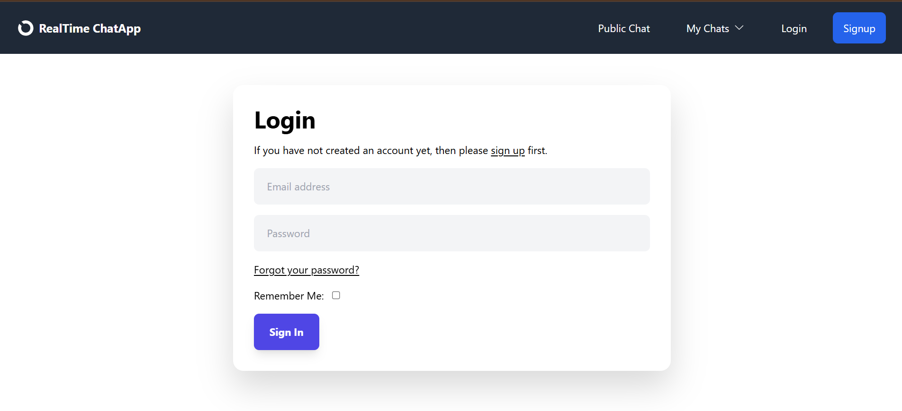
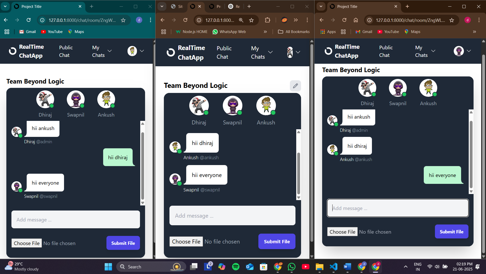
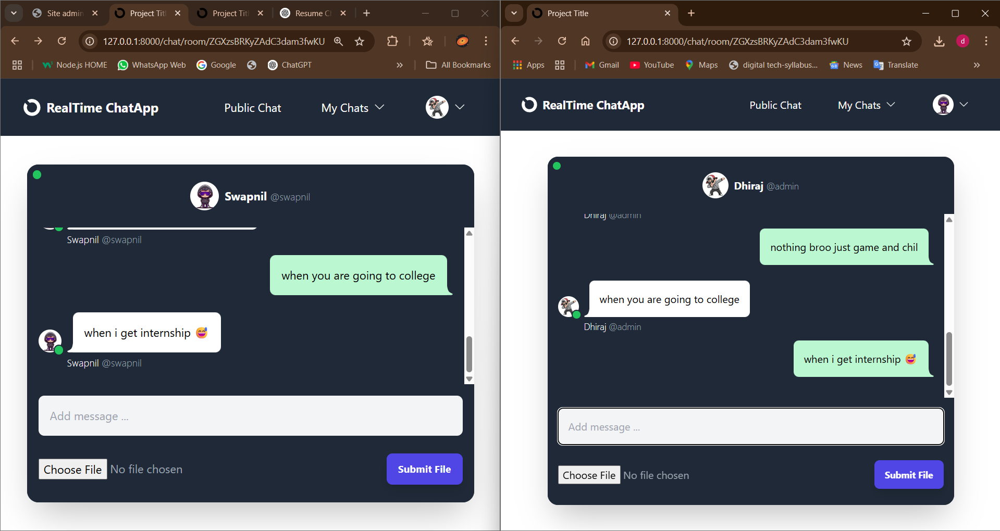
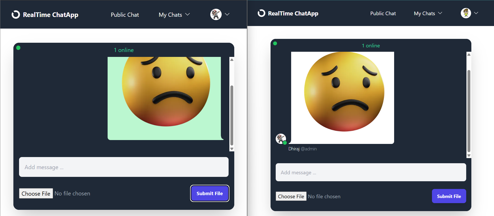

# 💬 RealTime ChatApp

A production-ready **real-time chat application** built using **Django**, **Django Channels**, **HTMX**, and **WebSockets**, supporting live communication with a modern and responsive UI.

---

## 🔗 Live Demo & Repository

- 🌐 **Live Demo**: [https://realtime-chatapp.yourdomain.com](https://realtime-chatapp.yourdomain.com)  
- 📁 **GitHub Repository**: [https://github.com/dhirajdurgade7758/realtime-chatapp](https://github.com/dhirajdurgade7758/realtime-chatapp)

---

## 📸 Screenshots

### 🔐 Login Page


### 💬 Group Chat Room


### 👤 Private Messaging


### 📁 File Upload Feature


---

## 🚀 Project Overview

**RealTime ChatApp** is a full-stack web app enabling users to communicate instantly via **group or private chatrooms**. The UI updates dynamically without page reloads, and the system supports file uploads, user presence indicators, and secure account verification.

Designed with scalability, security, and user experience in mind, this project showcases modern full-stack development with asynchronous backend logic and interactive frontend behavior.

---

## ✅ Features

- ⚡ **Real-Time Messaging** with WebSockets via Django Channels  
- 💬 **Group and Private Chats**  
- 🟢 **Live Online/Offline Indicators**  
- 📎 **File & Image Uploads** in chat  
- 🔐 **User Authentication** and Profile Management  
- ✉️ **Email Verification** for secure sign-up  
- 🎨 **HTMX-Powered Dynamic UI** (no page reloads)  
- 📱 **Responsive Design** with Tailwind CSS  

---

## 🛠️ Tech Stack

| Layer       | Tools & Libraries                        |
|-------------|-------------------------------------------|
| **Backend** | Python 3.x, Django 5.x, Django Channels    |
| **Frontend**| HTMX, Tailwind CSS                        |
| **Database**| SQLite (can be swapped with PostgreSQL/MySQL) |
| **Real-Time**| WebSockets via Django Channels            |
| **Deployment**| ASGI Server (e.g., Daphne/Uvicorn)       |

---

## 🧩 How It Works

- WebSocket connections are managed by **Django Channels**, allowing real-time communication between clients.
- Messages, user presence, and file uploads are pushed and received live without full page reloads using **HTMX**.
- **Email confirmation** is required before a user can access chatrooms, improving security.
- Uploaded images and files are previewed inline within chat messages.

---

## 📂 Getting Started

1. **Clone the Repository**
    ```sh
    git clone https://github.com/yourusername/realtime-chatapp.git
    cd realtime-chatapp
    ```

2. **Set Up Virtual Environment**
    ```sh
    python -m venv venv
    source venv/bin/activate  # or venv\Scripts\activate on Windows
    ```

3. **Install Dependencies**
    ```sh
    pip install -r requirements.txt
    ```

4. **Run Migrations and Create Superuser**
    ```sh
    python manage.py migrate
    python manage.py createsuperuser
    ```

5. **Start the Server**
    ```sh
    python manage.py runserver
    ```

---

## 🎯 Why This Project is Resume-Worthy

This project demonstrates:

- 🔄 Real-time full-stack architecture with **WebSockets**
- ✅ Hands-on implementation of **Django Channels** for asynchronous backend tasks
- 📊 Usage of **HTMX** for modern, JS-less interactivity
- 🔐 Secure authentication workflows with **email verification**
- 🧑‍💻 Scalable and modular code structure following Django best practices
- 🎨 Responsive UI with production-ready **Tailwind CSS** styling

---

## 🙋‍♂️ Author

**Dhiraj Durgade**  
[LinkedIn](https://www.linkedin.com/in/darshan-durgade) • [Portfolio](https://yourportfolio.com)

---

**Feel free to fork, clone, and reach out for collaboration!**
